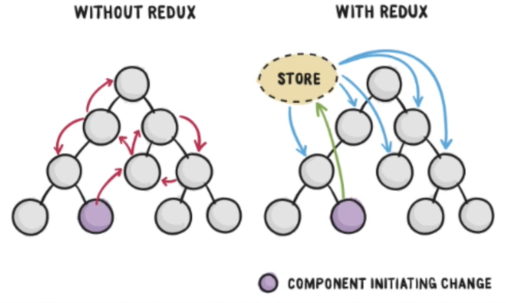
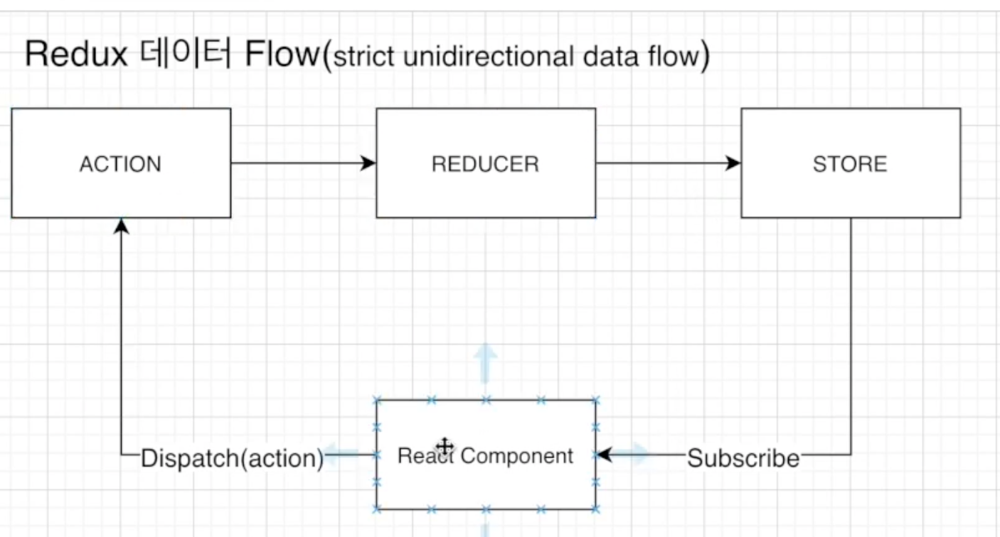

# 이 프로젝트에서 테스트  해볼 것

1. 로그인 기능 구현
2. 비밀번호 암호화 및 비밀번호 체크 기능
3. 몽고디비 및 몽구스 사용


### Auth 기능 만들기

- auth route 만들기
    - 페이지 이동때 마다 로그인 여부를 체크 가능하며, 관리자 유저인지 아닌지 확인 가능
    - 글을 쓺때나 지울때도 이러한  권한이 있는지 체크


- 저런 토큰들은 디코딩하면 유저 아이디, 회사 명 이런거 다 까서 볼  수 있음. aws 코그니토도 마찬가지였음!

1. 쿠키에서 저장된 토큰을 서버에서 가져와서 복호화를 한다.
2. 복호화를 하면 유저 아이디가 나옴. 그 유저 아이디를 이용해서 데이터베이스 유저 컬렉션에서 유저를 찾음
    - 쿠키에서 받아온 토큰이 유저도 갖고있는지 확인
    - 쿠키가 일치하지 않으면 인증 실패
    - 일치하면 인증 성공

### Redux in react.

- Redux -> 리덕스는 예측가능한 상태 컨테이너입니다. 상태 관리 라이브러리!

#### 리액트에서는 두가지 상태 관리 방법이 있는데

1. Props
    - 프로퍼티의 줄임말.
    - 프롭스는 다른 컴포넌트간 소통을 하는 방법임.
    - 프롭은 위에서 아래로, 부모 컴포난트에서 자식 컴포난트로 내려 보낼 수 있음
    - 프랍스는 자식컴포넌트로부터는 임뮤터블(변형 불가능한)임.
    - 즉 부모컴포넌트가 내려주는건  되는데, 자식 컴포넌트가 그걸 수정하는건 안됨
2. State
    - 부모 컴포넌트에서 자식으로 내려보내는게 아님
    - 컴포넌트 내부적으로  데이터를 교환할때 스테이트 사용.
    - 스테이트는 뮤터블함. 그리고 스테이트가 바뀌면 리렌더됨

- 그래서 리덕스는 스테이트를 관리하는 것임!

- 리덕스 없이는 상태 교환이 개판인데
- 리덕스가 있으면 그런 컴포넌트들 밖에서 한번에 관리를 하게 됨






### React Functional? Class

- 함수형 리액트 코딩이 대세. 예전에는 클래스형에서만 사용 가능하던 기능들이 훅이라는 이름으로
- 함수형에서도 구현 가능해졌다.
- 아래 코드  두개는 똑같은 기능을 한다.

```jsx
import React, { component } from 'react'
import Axios from 'axios'

export default class  Hello extends Component {

    constructor(props){
        super(props);
        this.state = { name: "" };
    }

    componentDidMount() { //componentDidMount 는 컴포넌트가 렌더 되었을때 수행될 함수인것. 이를 이제 훅에서는 useEffect라는 이름으로 지원하는거쥬
        Axios.get('/api/user/name')
            .then(res => {
                this.setState({ name: res.data.name })
            })
    }

    render() {
        return (
            <div>
                My name is {this.state.name}
            </div>
        )
    }
}

```

```jsx

import React, { useEffect, useState } from 'react'
import Axios from 'axios'

export default function Hello() {
    const [Name, setName] = useState("")

    useEffect(() => {
        Axios.get('/api/user/name')
            .then(res => {
                setName(res.data.name)
            })
    }, []) //[] <- dependencies list
}

return (
    <div>
        My  name is {Name}
    </div>
)
```