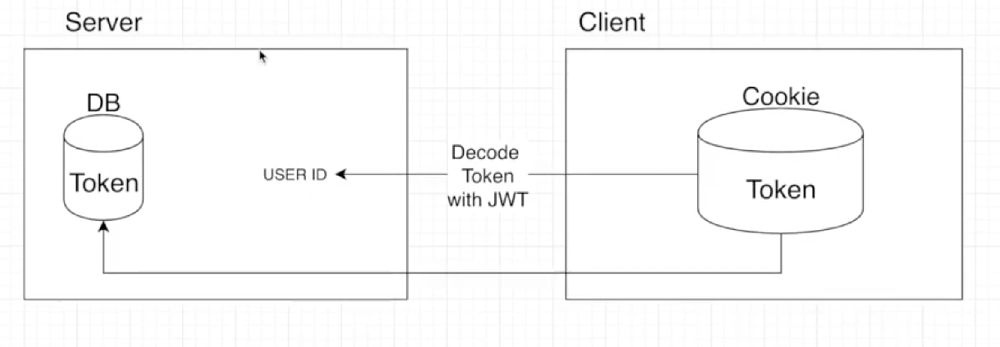

# 이 프로젝트에서 테스트  해볼 것

1. 로그인 기능 구현
2. 비밀번호 암호화 및 비밀번호 체크 기능
3. 몽고디비 및 몽구스 사용

### Auth 기능 만들기

- auth route 만들기
    - 페이지 이동때 마다 로그인 여부를 체크 가능하며, 관리자 유저인지 아닌지 확인 가능
    - 글을 쓺때나 지울때도 이러한  권한이 있는지 체크

- 저런 토큰들은 디코딩하면 유저 아이디, 회사 명 이런거 다 까서 볼  수 있음. aws 코그니토도 마찬가지였음!

1. 쿠키에서 저장된 토큰을 서버에서 가져와서 복호화를 한다.
2. 복호화를 하면 유저 아이디가 나옴. 그 유저 아이디를 이용해서 데이터베이스 유저 컬렉션에서 유저를 찾음
    - 쿠키에서 받아온 토큰이 유저도 갖고있는지 확인
    - 쿠키가 일치하지 않으면 인증 실패
    - 일치하면 인증 성공